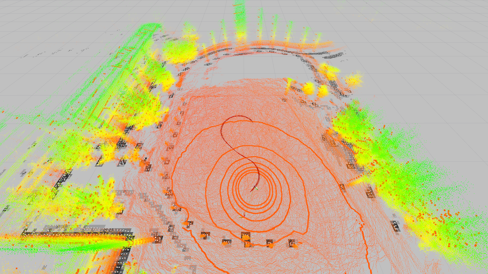

# 3D LIDAR Localization | ROS

ROS Packages for Real-Time 3D LIDAR Based Localization using Normal Distribution Transform (NDT) Scan Matching Algorithm and Unscented Kalman Filter (UKF) Estimation.



This localization algorithm performs Unscented Kalman Filter (UKF) based pose estimation. It first estimates the sensor pose from IMU data (IMU-based pose prediction is optional, if disabled, the system uses a constant velocity model) implemented on the LIDAR, and then performs multi-threaded NDT scan matching between a global map point cloud and input sensor point clouds to correct the estimated pose.

## Dependencies
***hdl_localization*** requires the following libraries:
- PCL
- OpenMP

***hdl_localization*** requires the following ROS packages:
- pcl_ros
- [ndt_omp](https://github.com/koide3/ndt_omp)
- [fast_gicp](https://github.com/SMRT-AIST/fast_gicp)
- [hdl_global_localization](https://github.com/koide3/hdl_global_localization)

## Installation

```bash
cd ROS1_Workspace
```
- For nominal NDT:
    ```
    catkin_make -DCMAKE_BUILD_TYPE=Release
    ```
- For CUDA-accelerated NDT:
    ```bash
    catkin_make -DCMAKE_BUILD_TYPE=Release -DBUILD_VGICP_CUDA=ON
    ```

## Configuration
- All configurable parameters are listed in `launch/hdl_localization.launch`.
- The estimated pose can be set and reset using using `2D Pose Estimate` in RViz.

## Topics
- ***/odom*** (nav_msgs/Odometry)
  - Estimated sensor pose in the map frame
- ***/aligned_points*** (sensor_msgs/PointCloud2)
  - Input point cloud aligned with the map
- ***/status*** (hdl_localization/ScanMatchingStatus)
  - Scan matching result information (e.g., convergence, matching error, and inlier fraction)

## Services
- ***/relocalize*** (std_srvs/Empty)
  - Reset the sensor pose with the global localization result

## Execution

Open a terminal and launch `hdl_localization`.
```bash
roslaunch hdl_localization hdl_localization.launch
```

Open another terminal and play a pre-recorded `rosbag` or start streming data from sensor.
```bash
rosparam set use_sim_time true
rosbag play --clock <ROSBAG_PATH>
```
Open another terminal and call a service to reset the sensor pose with the global localization result (if required).
```bash
rosservice call /relocalize
```

> **Note:** If the algorithm does not work very well or if the CPU usage is too high, change `ndt_neighbor_search_method` in `hdl_localization.launch` to `DIRECT1`. It makes the scan matching significantly fast, but is a bit unstable.
