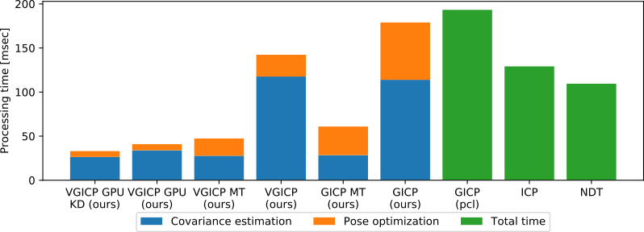

# fast_gicp

This package is a collection of GICP-based fast point cloud registration algorithms. It constains a multi-threaded GICP as well as multi-thread and GPU implementations of our voxelized GICP (VGICP) algorithm. All the implemented algorithms have the PCL registration interface so that they can be used as an inplace replacement for GICP in PCL.

- FastGICP: multi-threaded GICP algorithm (**\~40FPS**)
- FastGICPSingleThread: GICP algorithm optimized for single-threading (**\~15FPS**)
- FastVGICP: multi-threaded and voxelized GICP algorithm (**\~70FPS**)
- FastVGICPCuda: CUDA-accelerated voxelized GICP algorithm (**\~120FPS**)
- NDTCuda: CUDA-accelerated D2D NDT algorithm (**\~500FPS**)

