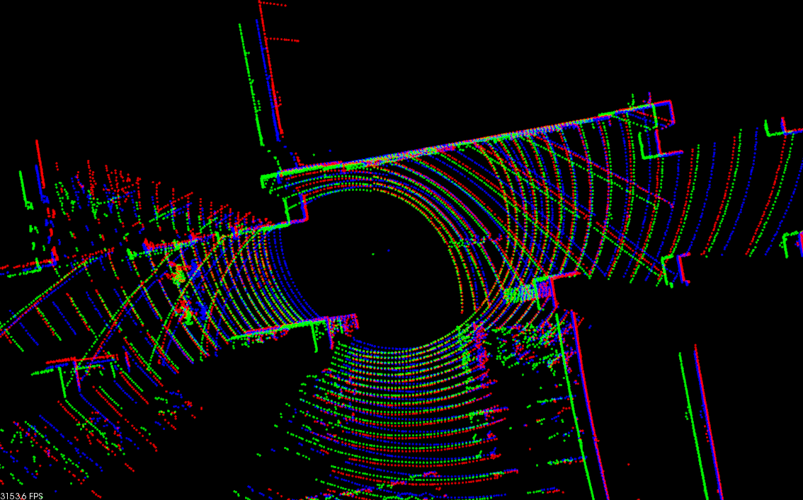

# ndt_omp

$${\mathrm{\color{limegreen}{Source \space PCD} \space \color{black}{|} \space \color{red}{Target \space PCD} \space \color{black}{|} \space \color{blue}{Aligned \space PCD}}}$$

This package provides an OpenMP-boosted Normal Distributions Transform (and GICP) algorithm derived from `pcl`. The `NDT` algorithm is modified to be SSE-friendly and multi-threaded. It can run up to 10 times faster than its original version in `pcl`.

Several methods for neighbor voxel search are implemented. If you select `pclomp::KDTREE`, results will be completely the same as that of the original `pcl::NDT`. We recommend using `pclomp::DIRECT7` which is faster and stable. If you need extremely fast registration, choose `pclomp::DIRECT1`, but it might be a bit unstable.